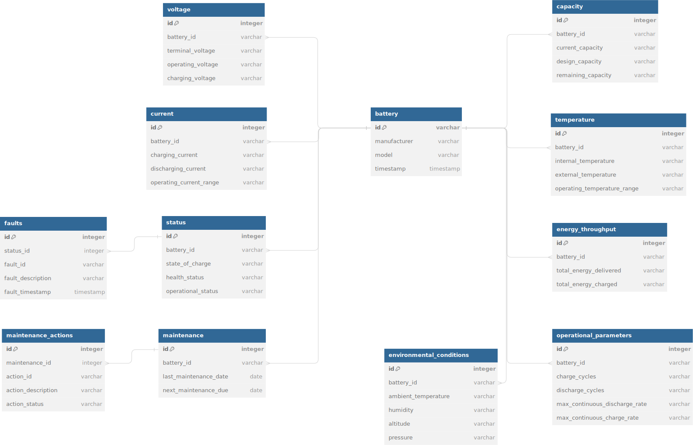

# Green Wind - Data Engineering Project
#### Author: Matthew Aylward 2023-12-28

Green Wind is an example of a ETL tool that can extract the information from semi-structed data (JSON) to store it in a Postgres Database. We are then able to connect to the PostgresDB instance with a Jupyter Notebook to explore the data in the ```notebooks/battery_data_analysis.ipynb``` notebook. 

## Project Overview

Green Wind can run on a Cloud Provider such as AWS, Azure, or GCP and can scale to handle large amounts of data. The endpoints of the application can be extended to display the data in a web application or mobile application. It can also be extend to handle streaming data from a MQTT broker, or Kafka. The application can also be extended to handle unstructed data such as images, pdfs, video, or audio. 

> [!NOTE]
> The Digital Twin application is not fully implemented, it is a work in progress 👷‍♂️

This application also looks into creating a Digital Twin of a battery to identify the health of the battery and predict the remaining useful life of the battery. This compares Gaussian Process Regression, Bayesian Neural Networks and Monte Carlo Methods to identify the best model to predict the remaining useful life of the battery. This
  is done in the ```notebooks/battery_data_analysis.ipynb``` notebook. The data is extracted from the csv files in ```data/raw/*```. The source of the Data and Data Science code is from here:
https://github.com/acthelen/battery_digital_twin and the raw files can be found in the ```digital_twin/``` folder.


### Real World Application

In a real world application we could stream this data from a MQTT broker into a MySQL instance similar to [Zendesk's Solution.](https://www.infoq.com/news/2023/12/zendesk-dynamodb-mysql-s3-cost/) We could use a tool like Apache Airflow or [Prefect](https://www.prefect.io/)" to schedule a job to extract with the data from the MySQL instance and use Apache Spark to process the data and store it store it in a Data Lake such as AWS S3. Then we could use a tool like AWS Glue to transform the data and store it in a Data Warehouse such as AWS Redshift or [Apache Iceberg](https://iceberg.apache.org/) for large scale analytics. 


Here is an example of some unstructered data that we will be working with, in this example you can post this data to the API endpoint ```localhost:8000/battery_data```


```json
{
  "battery_id": "B123456789",
  "manufacturer": "GreenPowerTech",
  "model": "GPT-5000",
  "capacity": {
    "current_capacity": "4000 kWh",
    "design_capacity": "5000 kWh",
    "remaining_capacity": "3500 kWh"
  },
  "voltage": {
    "terminal_voltage": "480 V",
    "operating_voltage": "450-500 V",
    "charging_voltage": "460 V"
  },
  "temperature": {
    "internal_temperature": "35°C",
    "external_temperature": "30°C",
    "operating_temperature_range": "20-40°C"
  },
  "current": {
    "charging_current": "100 A",
    "discharging_current": "95 A",
    "operating_current_range": "80-110 A"
  },
  "status": {
    "state_of_charge": "70%",
    "health_status": "Good",
    "operational_status": "Active",
    "faults": [
      {
        "fault_id": "F123",
        "fault_description": "Overtemperature warning",
        "fault_timestamp": "2023-12-21T09:00:00Z"
      },
      {
        "fault_id": "F124",
        "fault_description": "Low voltage alert",
        "fault_timestamp": "2023-12-21T09:00:00Z"
      }
    ]
  },
  "energy_throughput": {
    "total_energy_delivered": "2000 kWh",
    "total_energy_charged": "1800 kWh"
  },
  "maintenance": {
    "last_maintenance_date": "2023-12-20",
    "next_maintenance_due": "2024-06-20",
    "maintenance_actions": [
      {
        "action_id": "M123",
        "action_description": "Replace cooling fan",
        "action_status": "Completed"
      },
      {
        "action_id": "M124",
        "action_description": "Inspect insulation",
        "action_status": "Pending"
      }
    ]
  },
  "environmental_conditions": {
    "ambient_temperature": "28°C",
    "humidity": "60%",
    "altitude": "500 meters",
    "pressure": "1 atm"
  },
  "operational_parameters": {
    "charge_cycles": "150",
    "discharge_cycles": "140",
    "max_continuous_discharge_rate": "120 A",
    "max_continuous_charge_rate": "110 A"
  },
  "timestamp": "2023-12-21T10:00:00Z"
}
```
This application will take in this data and store it in a PostgresDB instance in the following schema:




# Set Up Instructions

### Option 1: Github Codespaces (devcontainer) - Automatic Dev Environment

To get started, create a codespace for this repository by clicking this 👇

[](https://github.com/codespaces/new?hide_repo_select=true&ref=main&repo=733376401&skip_quickstart=true&machine=standardLinux32gb&devcontainer_path=.devcontainer%2Fdevcontainer.json&geo=EuropeWest)

A selection menu will open allowing you to create a Codespace. After create a Codespace it  will open in a web-based version of Visual Studio Code. The [dev container](.devcontainer/devcontainer.json) is fully configured with software needed for this project along with added development vscode extensions such as [Jupyter Notebook](https://marketplace.visualstudio.com/items?itemName=ms-toolsai.jupyter), Python, and Docker.

Once the Codespace has been created, open a terminal and run the following command to start the poetry shell 

```bash
poetry shell
```
Install the packages from the pyproject.toml file using the following command:

```bash
poetry install
```

### Option 2: Local Machine - Visual Studio Code and Docker

This repository can be [used locally](https://code.visualstudio.com/docs/devcontainers/tutorial) on a system running Visual Studio Code and Docker, or in a remote cloud based [Codespaces](https://github.com/features/codespaces) environment as shown in Option 1.

1. Ensure you have Docker installed on your local machine, if not follow the instructions here: <https://docs.docker.com/get-docker/>

2. Clone the repository to your local machine
   ```git clone https://github.com/Butch78/green-wind.git```

3. After you open the root project in Vscode, the following pop-up should appear. Click "Reopen in Container"

If not click the button in the bottom left corner and then select "Reopen in Container" or type into the command prompt at the top an enter the following command ```>Reopen in container```

This will build the Docker container, run the PostgresDB and should install packages using the poetry package manager. if not run the following command in the terminal:

Once the Devcontainer has been created, open a terminal and run the following command to start the poetry shell 

```bash
poetry shell
```
Install the packages from the pyproject.toml file using the following command:

```bash
poetry install
```

# Starting The Application

Then the following command will load the Data into the PostgresDB and start a FastAPI application on port 8000, You can view the API documentation at <http://localhost:8000/docs>

```bash
uvicorn app.main:app
```

Once the application has started The csv files from ```/data/raw```  will automatically be loaded into the PostgresDB instance. 

It will also create some fake Battery data. We can then connect to the Jupyter Notebook: ```notebooks/battery_data_analysis.ipynb```  to explore the data with a read only connection to the PostgresDB instance.


